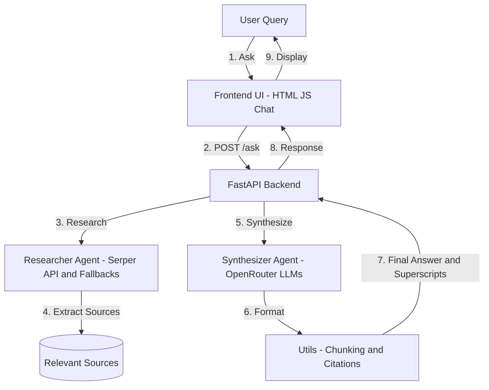

# 🦙 Data Llama – Business Analyst Agent

Data Llama is a simple, **autonomous agent** system that can research this business  concept online, synthesize the findings from multiple sources, and produce a single, reliable, 
and well-cited answer for the student .

It combines **web research**, **AI summarization**, and a **chat-style UI** to provide reliable, source-backed insights.

---

## Features
- **Automated Research** via Serper API + fallback search.  
- **LLM-based Synthesis** with OpenRouter (Gemini, Llama, Grok, DeepSeek, etc.).  
- **Citations & Sources** auto-formatted into superscripts.  
-  **Interactive UI** with chat history, model selection, markdown & math support.  
-  **Robust Error Handling** with retries, exponential backoff, and fallbacks.  

---

## Architecture



**Flow:**  
1. User submits a query.  
2. Frontend sends request to `/ask`.  
3. Researcher finds & extracts high-quality sources.  
4. Synthesizer calls chosen LLM via OpenRouter.  
5. Utils handle chunking, citations, and formatting.  
6. Answer is returned with sources → displayed in chat.  

---

##  Research Strategy
1. **Serper API** → Primary search + content extraction.  
2. **Fallback to OpenRouter** → LLM generates reputable URLs if Serper fails.  
3. **Content Extraction** → Using Serper Extract API or Newspaper3k.  
4. **Reliability Filters** → Prefers accessible, non-paywalled, reputable sites.  

---

## LLMs Used
Supported through **OpenRouter API**:

- Google **Gemini 2.0 Flash** (default)  
- Meta **Llama 3.3 70B**  
- xAI **Grok 4 Fast**  
- Microsoft **MAI-DS R1**  
- DeepSeek **Chat v3.0 / v3.1**  
- OpenAI **GPT OSS 20B**  
- Mistral **7B & 24B**  
- Google **Gemma 27B**  

**Why multiple models?**  
- Flexibility: speed vs reasoning trade-offs.  
- Fallbacks: avoids downtime from rate limits.  
- Reliability: OpenRouter provides consistent API handling.  

---

## Synthesizer Agent Logic
1. **Chunk content** into smaller sections.  
2. **Construct prompt** with context, question, and sources.  
3. **Call OpenRouter API** with retries + backoff.  
4. **Generate citations** and insert superscripts.  
5. **Fallback** → If synthesis fails, return sources with summaries.  

---

## Setup & Installation

### 1. Clone Repo
```bash
git clone https://github.com/anonymousknight07/Data-Lama-.git
cd Data-Lama
```

### 2. Environment Variables
Create a `.env` file:
```bash
OPENROUTER_API_KEY=your_openrouter_api_key
SERPER_API_KEY=your_serper_api_key
HOST=127.0.0.1
PORT=8000
```

### 3. Install Dependencies
```bash
pip install -r requirements.txt
```

### 4. Run the Server
```bash
bash run.sh
```
Or manually:
```bash
uvicorn app.main:app --reload
```

### 5. Open in Browser
Go to:
```
http://127.0.0.1:8000
```

---

## 📦 Requirements
See [`requirements.txt`](requirements.txt)  
Includes:
- `fastapi`, `uvicorn`, `requests`, `newspaper3k`, `jinja2`, `beautifulsoup4`, etc.  

---

## ✅ Health Check
Test server status:
```bash
curl http://127.0.0.1:8000/health
```

---

## 📜 License
MIT License – free to use and modify.  

---

### ✨ Built with love by Akshat
